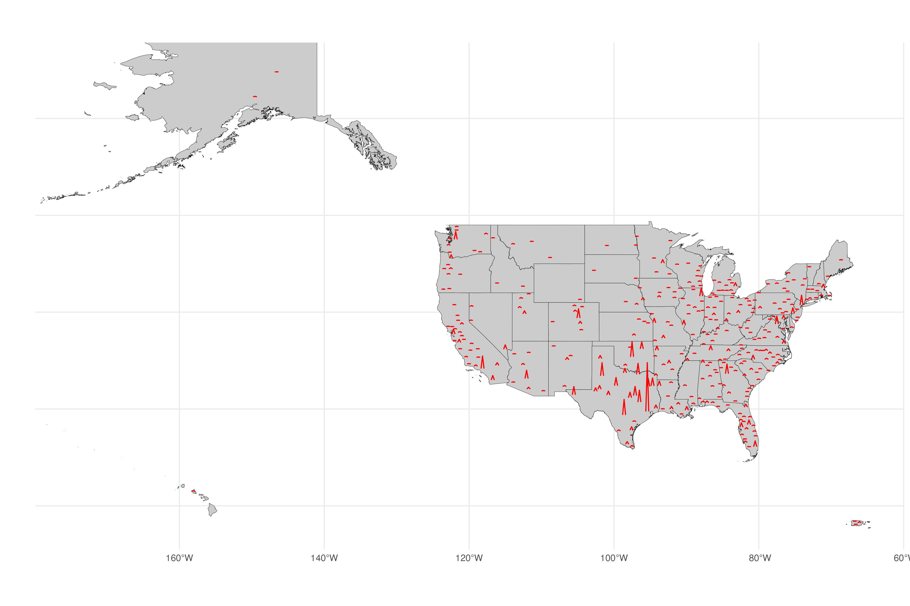

<h1 align="center">

Housing Vacancy Mapping Project

</h1>

Using the [spikemap](https://github.com/rCarto/spikemap) package to build spike maps of Metropolitan Service Area migration rates relative to housing availability.

Next Up

Bivariate Map of Housing vacancy per capita and inbound migration per capita.

See also [Tableau Public](https://public.tableau.com/app/profile/dan.gunn/viz/Housing_sf_4/Dashboard1)
